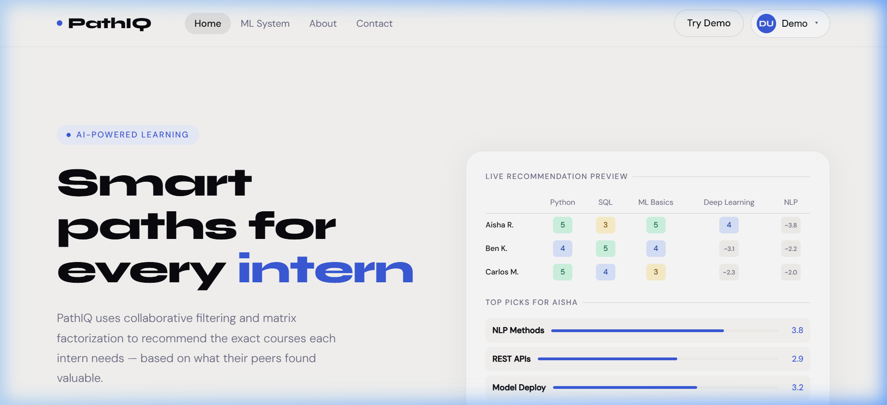

# LearnPath Engine



LearnPath Engine is a professional-grade recommendation system designed to map interns to the most relevant learning paths based on latent factor analysis. It utilizes a custom implementation of Stochastic Gradient Descent (SGD) to optimize user and item embedding matrices, providing high-precision course suggestions.

## 🚀 Features

- **Matrix Factorization (MF)**: Core recommendation logic using SGD optimization.
- **Dynamic Learning Paths**: Tailored course recommendations based on intern profile and history.
- **Real-time Training Visualization**: Interactive charts showing RMSE convergence during model optimization.
- **Latent Factor Discovery**: Visualization of hidden relationships between interns and technology domains.
- **Professional Dashboard**: Sleek, responsive UI with glassmorphism aesthetics.
- **Persistence**: Local storage integration for saving model weights and application state.

## 🛠️ Tech Stack

- **Frontend**: HTML5, Vanilla CSS3 (Custom Design System)
- **Engine**: Vanilla JavaScript (Matrix Factorization implementation)
- **Typography**: Syne (Headers), Inter (Body)
- **Icons**: Lucide-inspired SVG components

## 📂 Project Structure

```text
learnpath-engine/
├── index.html          # Application entry point
├── css/
│   └── style.css       # Core design system and styles
├── js/
│   ├── ml-engine.js    # Matrix Factorization and SGD logic
│   ├── script.js       # UI Controller and orchestration
│   ├── data.js         # Course and intern datasets
│   └── trained-weights.js # Pre-computed model artifacts
├── images/             # Static assets and media
├── docs/               # Architecture and standards documentation
├── scripts/            # Utility and automation scripts
└── tests/              # Test suite (Unit/Integration)
```

## ⚙️ Local Setup

1. **Clone the repository:**
   ```bash
   git clone https://github.com/Najeeb1106/learnpath-engine.git
   cd learnpath-engine
   ```

2. **Run a local server:**
   You can use any static file server. For example, using Python:
   ```bash
   python -m http.server 8000
   ```

3. **Access the application:**
   Open `http://localhost:8000` in your browser.

## 🧠 Engineering Decisions

- **Client-Side ML**: Implemented the MF engine in vanilla JS to demonstrate high-performance computation without heavy external dependencies.
- **Defensive Design**: Built robust error handling for matrix operations to prevent UI crashes during weight initialization.
- **Separation of Concerns**: Modularized the ML logic (`ml-engine.js`) from the UI orchestration (`script.js`) to follow professional standards.

## 📄 License

This project is licensed under the MIT License - see the [LICENSE](LICENSE) file for details.

---

**Developed by [Najeeb Ullah Tahir](https://github.com/Najeeb1106)**  
*ML Engineer & Full Stack developer*
